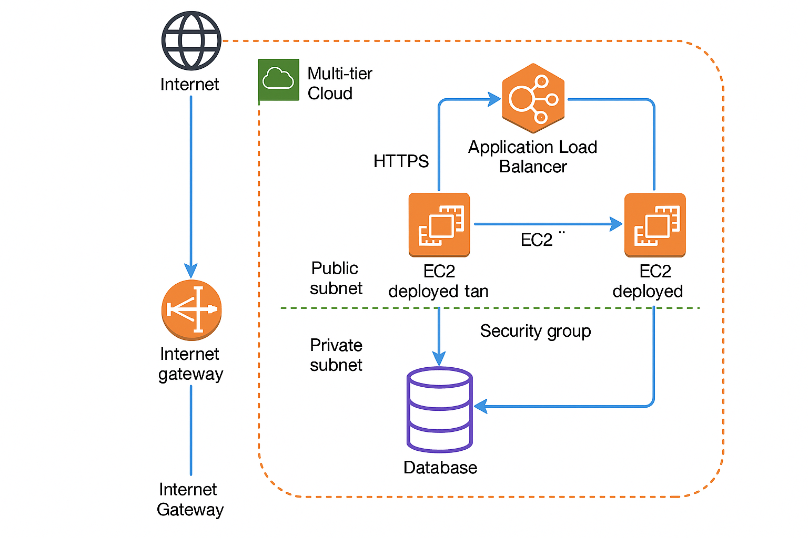

# AWS Multi-Tier Architecture (Terraform)

This repository provisions a **secure and scalable AWS multi-tier architecture** using Terraform. It follows AWS best practices and is designed for hosting web applications with a private backend database.

---

## 📌 Architecture Diagram


---

## 🚀 Features
- Custom **VPC** with public and private subnets across multiple Availability Zones.
- **Application Load Balancer (ALB)** for high availability and load distribution.
- **EC2 instances** in public subnets to serve the web application.
- **RDS MySQL database** deployed in private subnets for secure backend data storage.
- **Security Groups** with least privilege rules (EC2 to RDS only).
- Modular **Terraform design** for reusability and scalability.

---

## 🛠️ Usage

### 1️⃣ Clone Repository
```bash
git clone https://github.com/<your-username>/aws-multi-tier-architecture.git
cd aws-multi-tier-architecture
2️⃣ Update Variables
Edit variables.tf and provide:

AWS region

EC2 key pair name

RDS database username & password

3️⃣ Deploy Infrastructure
Initialize and apply Terraform:

bash
Copy
Edit
terraform init
terraform apply
4️⃣ Access the Application
The output will display the ALB DNS name.

Open it in your browser to access the web application.

📦 Modules Included
VPC Module: Creates VPC, subnets, internet gateway, and routing.

EC2 Module: Launches EC2 instances and configures ALB.

RDS Module: Deploys RDS MySQL in private subnets with secure SG rules.

🔒 Security Considerations
Database is private and inaccessible from the internet.

Security groups enforce strict communication rules.

Use AWS Secrets Manager or SSM Parameter Store for DB credentials in production.

VPC Flow Logs and CloudWatch recommended for monitoring.

🖼️ Repository Structure
css
Copy
Edit
aws-multi-tier-architecture/
├── architecture-diagram.png
├── main.tf
├── variables.tf
├── outputs.tf
├── modules/
│   ├── vpc/
│   │   ├── main.tf
│   │   ├── variables.tf
│   │   └── outputs.tf
│   ├── ec2/
│   │   ├── main.tf
│   │   ├── variables.tf
│   │   └── outputs.tf
│   └── rds/
│       ├── main.tf
│       ├── variables.tf
│       └── outputs.tf
🏷️ License
This project is licensed under the MIT License.

yaml
Copy
Edit

---

### ✅ Next Steps:
1. Place the `architecture-diagram.png` file in the root of the repo.
2. Replace `<your-username>` in the README with your GitHub username.
3. Commit and push:
```bash
git add README.md architecture-diagram.png
git commit -m "Added README with architecture diagram"
git push origin main
